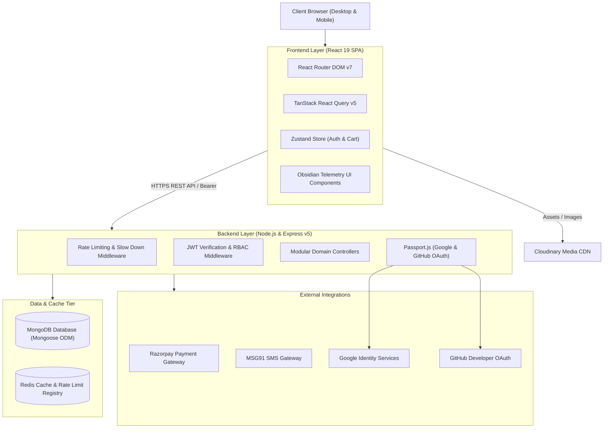
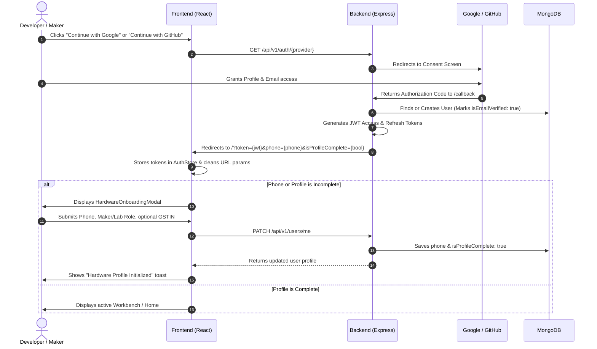
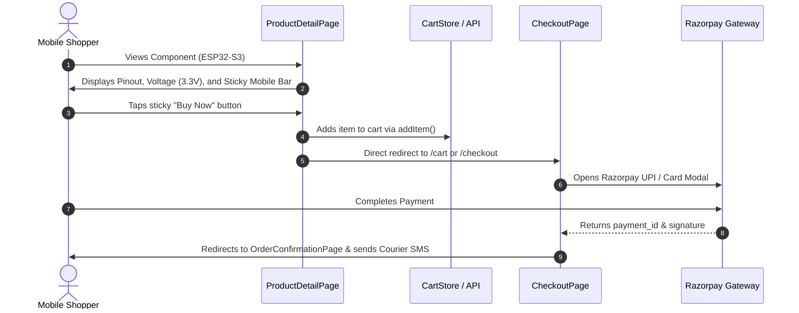

# System Architecture & Technical Specifications

## 1. System Architecture Overview

SparkTech employs a decoupled, client-server architecture designed for high availability, sub-second page transitions, and robust token-based security across cross-domain environments.



---

## 2. High-Level Tech Stack

### Frontend
- **Framework**: React 19 (SPA bootstrapped with Create React App)
- **Routing**: React Router DOM v7
- **State Management**:
  - Global Client State: Zustand (Auth store, Cart store, Theme store with localStorage persistence)
  - Server Cache & Synchronization: TanStack React Query v5
- **Animations & Micro-interactions**: Framer Motion
- **Form Handling & Validation**: React Hook Form + Zod
- **Icons & Visuals**: Lucide React + Custom SVG Hardware Circuit Canvas
- **Design Tokens & Styling**: Pure CSS Custom Properties (Obsidian Telemetry tokens, zero runtime CSS bloat)
- **Data Export**: JSPDF, jspdf-autotable, XLSX

### Backend
- **Runtime & Framework**: Node.js & Express.js (v5)
- **Database**: MongoDB with Mongoose ODM (v9)
- **Caching & Rate Limiting**: Redis / ioredis with `connect-redis` and `express-rate-limit`
- **Authentication & Security**:
  - Passport.js (`passport-google-oauth20`, `passport-github2`)
  - JSON Web Tokens (`jsonwebtoken`) with dual-path Bearer and HTTP-only cookie support
  - Helmet for secure HTTP headers, CORS whitelisting
  - Bcrypt.js for system credentials
- **Payment Processing**: Razorpay API
- **Media Hosting**: Cloudinary with Multer storage
- **Communications**: MSG91 SMS API & Nodemailer
- **Logging & Monitoring**: Winston logger & Sentry Node SDK

---

## 3. Repository Folder Structure

```
Sparktech-commerce-store/
├── backend/
│   ├── server.js                        # Express server entry point & middleware bootstrap
│   ├── src/
│   │   ├── config/
│   │   │   ├── db.js                    # MongoDB Mongoose connection
│   │   │   ├── redis.js                 # Redis client & cache layer
│   │   │   └── passport.js              # Google & GitHub OAuth Strategy definitions
│   │   ├── middleware/
│   │   │   ├── auth.middleware.js       # JWT extraction & route protection
│   │   │   ├── rbac.middleware.js       # Role-Based Access Control (customer, admin, masteradmin)
│   │   │   ├── rateLimit.middleware.js  # Redis-backed rate limiting & login slowdown
│   │   │   └── validate.middleware.js   # Zod request validation wrapper
│   │   ├── models/
│   │   │   ├── User.model.js            # User schema (OAuth, phone, accountType, gstin, addresses)
│   │   │   ├── Product.model.js         # Product schema (variants, specs, datasheets, stock)
│   │   │   ├── Order.model.js           # Order schema (items, pricing, status, tracking)
│   │   │   ├── Category.model.js        # Category hierarchy schema
│   │   │   ├── Review.model.js          # Product ratings and reviews
│   │   │   └── Notification.model.js    # User notification model
│   │   ├── modules/
│   │   │   ├── auth/                    # OAuth controllers, services, routes, and schemas
│   │   │   ├── users/                   # Customer profile, addresses, and onboarding update
│   │   │   ├── products/                # Catalog CRUD, filters, and inventory tracking
│   │   │   ├── cart/                    # Persistent shopping cart management
│   │   │   ├── orders/                  # Order placement, status transitions, and tracking
│   │   │   ├── payments/                # Razorpay verification and webhook handling
│   │   │   └── reviews/                 # Verified buyer review system
│   │   └── utils/
│   │       ├── apiResponse.js           # Standardized JSON response envelope
│   │       ├── AppError.js              # Operational error constructor
│   │       └── asyncHandler.js          # Async wrapper for route controllers
│   └── package.json
│
├── frontend/
│   ├── public/                          # Public static assets, HTML index, and favicon
│   ├── src/
│   │   ├── index.js                     # React DOM entry point
│   │   ├── index.css                    # "Obsidian Telemetry" design system & token definitions
│   │   ├── App.js                       # Root routing, route guards, and global modals
│   │   ├── components/
│   │   │   ├── auth/
│   │   │   │   └── HardwareOnboardingModal.jsx # Post-OAuth courier & maker profile completion
│   │   │   ├── layout/
│   │   │   │   ├── Navbar.jsx           # Global sticky navigation with live cart count
│   │   │   │   ├── Footer.jsx           # Hardware compliance and platform links
│   │   │   │   └── AdminLayout.jsx      # Admin panel sidebar & topbar layout
│   │   │   └── ui/
│   │   │       ├── CircuitBackground.jsx # Animated SVG PCB circuit traces & pulses
│   │   │       └── FallbackState.jsx    # Empty, error, and offline UI placeholders
│   │   ├── features/
│   │   │   └── cart/
│   │   │       └── CartDrawer.jsx       # Quick slide-out cart drawer
│   │   ├── pages/
│   │   │   ├── HomePage.jsx             # Hero, category grid, featured components
│   │   │   ├── ProductListPage.jsx      # Parametric filtering, search, sorting
│   │   │   ├── ProductDetailPage.jsx    # Specs, pinouts, datasheet, reviews, sticky mobile CTA
│   │   │   ├── LoginPage.jsx            # Pure Google & GitHub OAuth hardware stage
│   │   │   ├── RegisterPage.jsx         # Zero-password registration gateway
│   │   │   ├── CartPage.jsx             # Detailed cart review
│   │   │   ├── CheckoutPage.jsx         # Address selection, GSTIN, Razorpay trigger
│   │   │   ├── OrdersPage.jsx           # Order tracking and invoice downloads
│   │   │   └── ProfilePage.jsx          # Address book, maker settings, profile editing
│   │   ├── store/
│   │   │   ├── authStore.js             # Zustand auth state & JWT token synchronization
│   │   │   ├── cartStore.js             # Zustand cart state with guest/auth merging
│   │   │   └── themeStore.js            # Light/Dark mode state
│   │   └── lib/
│   │       ├── axios.js                 # Configured Axios instance with token refresh interceptor
│   │       └── queryClient.js           # TanStack React Query client configuration
│   └── package.json
│
├── docs/                                # Technical, architecture, and design documentation
└── README.md
```

---

## 4. Primary User Flows

### Flow 1: Zero-Password OAuth & Hardware Onboarding



### Flow 2: Mobile Spec Discovery & 1-Tap Purchase



---

## 5. Information Architecture (IA)

```
SparkTech Platform
├── 1. Storefront (Public)
│   ├── Home
│   │   ├── Live System Telemetry Status
│   │   ├── Featured Robotics Kits & Microcontrollers
│   │   ├── Category Matrix
│   │   └── Authenticity & ESD Badges
│   ├── Component Catalog (/shop)
│   │   ├── Parametric Filters (Voltage, Protocol, Package, Stock)
│   │   ├── Instant Search & Part Number Lookup
│   │   └── Sorting (Price, Popularity, Newest)
│   ├── Product Detail (/shop/:slug)
│   │   ├── Pinout & Image Zoom Stage
│   │   ├── Specification Matrix (Voltage, Clock, Flash, GPIO)
│   │   ├── Datasheet PDF Download
│   │   ├── Sticky Mobile Action Bar (Price + Cart + Buy Now)
│   │   └── Verified Customer Reviews
│   └── Services (/services)
│       ├── Custom Cable Assembly
│       └── Drone & Robot Fabrication Consultation
│
├── 2. Authentication & Onboarding
│   ├── Hardware Gateway (/login & /register)
│   │   ├── Animated Vector PCB Circuit Canvas
│   │   ├── Google OAuth 2.0 Sign-in
│   │   └── GitHub OAuth 2.0 Sign-in
│   └── Hardware Onboarding Modal (Automatic Post-Auth)
│       ├── Courier Dispatch Phone Verification
│       ├── Role Selection (Maker vs Research Lab)
│       └── B2B GSTIN Tax ID Entry
│
├── 3. Shopping & Checkout
│   ├── Cart Drawer & Cart Page (/cart)
│   │   └── Real-time Quantity Sync & Subtotal
│   ├── Checkout (/checkout)
│   │   ├── Workbench Address Selection / Creation
│   │   ├── GST Commercial Invoicing Toggle
│   │   └── Razorpay Secure Payment
│   └── Order Confirmation (/order-confirmation/:id)
│
├── 4. Customer Portal (Protected)
│   ├── Profile (/profile)
│   │   ├── Personal & Contact Telemetry
│   │   ├── Address Book Management
│   │   └── Maker / Business Settings
│   ├── Orders (/orders)
│   │   ├── Live Dispatch Status Tracking
│   │   └── PDF Commercial Invoice Download
│   └── Wishlist (/wishlist)
│
└── 5. Hardware Admin Console (/admin/*)
    ├── Telemetry Overview (Revenue, Orders, Low Stock Alerts)
    ├── Inventory & Product CRUD
    ├── Order Fulfillment & Status Pipeline
    ├── Customer Database
    └── System Audit Logs
```
