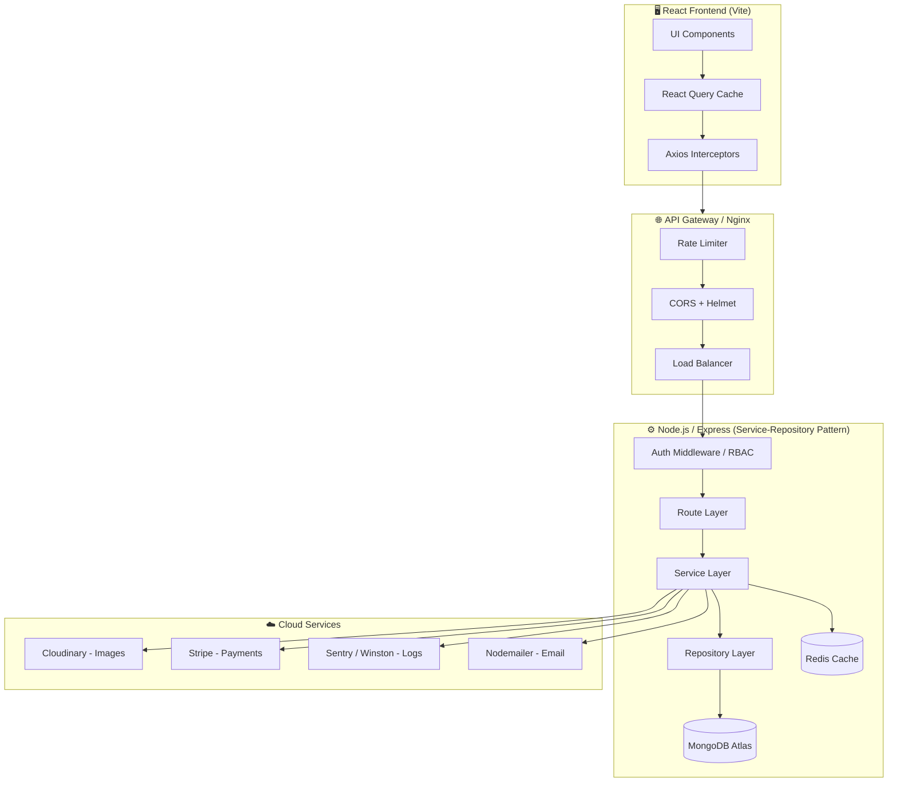
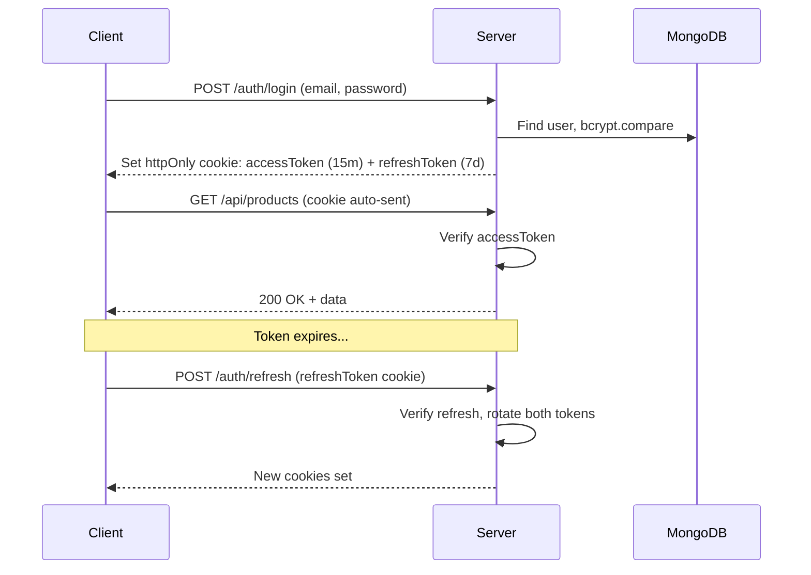

# 🤖 RoboMart — Production-Ready MERN E-Commerce Guide
### For Electronic & Robotic Components

> A complete blueprint to build, secure, scale, and put on your CV.

---

## Table of Contents
1. [System Architecture Overview](#1-system-architecture)
2. [Tech Stack Decision Matrix](#2-tech-stack)
3. [Folder Structure](#3-folder-structure)
4. [MongoDB Schema Design](#4-mongodb-schema)
5. [Security & Auth (Zero-Trust)](#5-security--auth)
6. [API Design & Routes](#6-api-design)
7. [Payment Gateway — Stripe](#7-stripe-payments)
8. [Image & File Pipeline](#8-image--file-pipeline)
9. [Redis Caching Strategy](#9-redis-caching)
10. [Performance & Scaling](#10-performance--scaling)
11. [UI/UX Design System](#11-uiux-design)
12. [Important Pages](#12-important-pages)
13. [Error Handling & Observability](#13-error-handling)
14. [CV & Interview Advice](#14-cv--interview-advice)

---

## 1. System Architecture

### Data Flow Diagram



### Service-Repository Pattern

```
Route → Controller → Service → Repository → MongoDB
              ↓
          Service → Redis (Cache hit? serve early)
```

- **Route**: Express router, just maps HTTP verb → controller method
- **Controller**: Handles req/res, calls service, sends response
- **Service**: Business logic (pricing rules, stock checks, order state machine)
- **Repository**: Only MongoDB queries — no business logic allowed here
- **Redis**: Sits in the Service layer, checked before hitting the DB

---

## 2. Tech Stack

| Layer | Technology | Why |
|---|---|---|
| **Frontend** | React 18 + Vite | Fast HMR, tree-shaking |
| **State (Server)** | TanStack Query v5 | Cache, invalidation, optimistic updates |
| **State (Client)** | Zustand | Lightweight, no boilerplate |
| **Styling** | Tailwind CSS + Framer Motion | Utility-first + animations |
| **UI Library** | shadcn/ui | Headless, fully customizable |
| **Backend** | Node.js + Express | Non-blocking I/O, massive ecosystem |
| **Database** | MongoDB Atlas | Flexible schema for product variants |
| **Cache** | Redis (Upstash serverless) | Low-latency reads, session store |
| **Auth** | JWT (access + refresh) in HTTP-only cookies | Secure, stateless |
| **Payments** | Stripe | Industry standard, webhooks |
| **Images** | Cloudinary | Transformations, WebP, CDN |
| **Validation** | Zod (BE) + React Hook Form + Zod (FE) | End-to-end type safety |
| **Email** | Nodemailer + Resend/SendGrid | Order confirmations, OTPs |
| **Search** | MongoDB Atlas Search (Lucene) or Meilisearch | Full-text + faceted filtering |
| **Logging** | Winston + Sentry | Structured logs + error tracking |
| **Testing** | Vitest + Testing Library + Supertest | Unit + integration |
| **Deployment** | Railway / Render (BE) + Vercel (FE) | Free tier, easy env vars |
| **CI/CD** | GitHub Actions | Auto-deploy on push |

---

## 3. Folder Structure

### Backend (Node.js)

```
server/
├── src/
│   ├── config/             # DB, Redis, Cloudinary, Stripe init
│   │   ├── db.js
│   │   ├── redis.js
│   │   └── cloudinary.js
│   ├── modules/            # Feature-based modules
│   │   ├── auth/
│   │   │   ├── auth.routes.js
│   │   │   ├── auth.controller.js
│   │   │   ├── auth.service.js
│   │   │   └── auth.repository.js
│   │   ├── products/
│   │   │   ├── product.routes.js
│   │   │   ├── product.controller.js
│   │   │   ├── product.service.js
│   │   │   ├── product.repository.js
│   │   │   └── product.schema.js     # Zod validation
│   │   ├── orders/
│   │   ├── users/
│   │   ├── cart/
│   │   └── payments/
│   │       ├── stripe.controller.js
│   │       └── stripe.webhook.js
│   ├── middleware/
│   │   ├── auth.middleware.js       # JWT verify
│   │   ├── rbac.middleware.js       # Role check
│   │   ├── rateLimit.middleware.js
│   │   ├── validate.middleware.js   # Zod wrapper
│   │   ├── upload.middleware.js     # Multer
│   │   └── errorHandler.middleware.js
│   ├── models/             # Mongoose schemas
│   │   ├── User.model.js
│   │   ├── Product.model.js
│   │   ├── Order.model.js
│   │   └── Category.model.js
│   ├── utils/
│   │   ├── logger.js               # Winston
│   │   ├── apiResponse.js          # Standardized response
│   │   └── asyncHandler.js         # try/catch wrapper
│   └── app.js
├── .env
├── .env.example
└── package.json
```

### Frontend (React + Vite)

```
client/
├── src/
│   ├── features/           # Feature-sliced design
│   │   ├── auth/
│   │   │   ├── components/
│   │   │   ├── hooks/
│   │   │   ├── api/
│   │   │   └── store/
│   │   ├── products/
│   │   │   ├── components/
│   │   │   │   ├── ProductCard.jsx
│   │   │   │   ├── ProductFilters.jsx
│   │   │   │   ├── VariantSelector.jsx
│   │   │   │   └── TechSpecsTable.jsx
│   │   │   ├── hooks/
│   │   │   │   └── useProducts.js   # TanStack Query
│   │   │   └── api/
│   │   ├── cart/
│   │   ├── checkout/
│   │   ├── orders/
│   │   └── admin/
│   ├── components/         # Shared components
│   │   ├── ui/             # shadcn base components
│   │   ├── layout/
│   │   │   ├── Navbar.jsx
│   │   │   └── Footer.jsx
│   │   └── common/
│   │       ├── Breadcrumb.jsx
│   │       └── LoadingSkeleton.jsx
│   ├── hooks/              # Global hooks
│   ├── lib/
│   │   ├── axios.js        # Axios instance + interceptors
│   │   └── queryClient.js
│   ├── store/              # Zustand stores
│   │   ├── cartStore.js
│   │   └── authStore.js
│   ├── pages/
│   └── App.jsx
```

---

## 4. MongoDB Schema Design

### Product Model (with Variants + Attribute-Value Pattern)

```js
// models/Product.model.js
const mongoose = require('mongoose');

// Technical attribute: { key: "Voltage", value: "12V", unit: "V" }
const AttributeSchema = new mongoose.Schema({
  key:   { type: String, required: true },  // e.g., "Voltage"
  value: { type: String, required: true },  // e.g., "12"
  unit:  { type: String },                  // e.g., "V"
}, { _id: false });

const VariantSchema = new mongoose.Schema({
  sku:        { type: String, required: true, unique: true },
  label:      { type: String, required: true }, // e.g., "12V / 2A"
  price:      { type: Number, required: true },
  stock:      { type: Number, default: 0 },
  attributes: [AttributeSchema],              // variant-specific specs
  images:     [String],                       // Cloudinary URLs
}, { _id: true });

const ProductSchema = new mongoose.Schema({
  name:         { type: String, required: true, index: true },
  slug:         { type: String, required: true, unique: true },
  description:  String,
  category:     { type: mongoose.Schema.Types.ObjectId, ref: 'Category', index: true },
  brand:        { type: String, index: true },
  tags:         [String],
  basePrice:    Number,                         // lowest variant price (for filtering)
  images:       [String],                       // primary product images
  datasheet:    String,                         // Cloudinary PDF URL
  attributes:   [AttributeSchema],              // common specs for all variants
  variants:     [VariantSchema],                // voltage, current options
  ratings: {
    average: { type: Number, default: 0 },
    count:   { type: Number, default: 0 },
  },
  isFeatured:   { type: Boolean, default: false },
  isActive:     { type: Boolean, default: true },
}, { timestamps: true });

// Compound indexes for filtering performance
ProductSchema.index({ category: 1, basePrice: 1 });
ProductSchema.index({ 'attributes.key': 1, 'attributes.value': 1 });
ProductSchema.index({ name: 'text', tags: 'text', description: 'text' });

module.exports = mongoose.model('Product', ProductSchema);
```

### Order Model (with Idempotency)

```js
const OrderSchema = new mongoose.Schema({
  user:            { type: mongoose.Schema.Types.ObjectId, ref: 'User' },
  items:           [{ product: ObjectId, variant: ObjectId, qty: Number, price: Number }],
  totalAmount:     Number,
  status:          { type: String, enum: ['pending','paid','processing','shipped','delivered','cancelled'] },
  stripeSessionId: { type: String, unique: true },   // idempotency key
  stripePaymentId: String,
  shippingAddress: { ... },
}, { timestamps: true });
```

---

## 5. Security & Auth

### Zero-Trust JWT Flow



### Auth Middleware

```js
// middleware/auth.middleware.js
const jwt = require('jsonwebtoken');

exports.protect = asyncHandler(async (req, res, next) => {
  const token = req.cookies?.accessToken;
  if (!token) throw new AppError('Not authenticated', 401);

  const decoded = jwt.verify(token, process.env.JWT_ACCESS_SECRET);
  req.user = await User.findById(decoded.id).select('-password');
  next();
});
```

### RBAC Middleware

```js
// middleware/rbac.middleware.js
exports.authorize = (...roles) => (req, res, next) => {
  if (!roles.includes(req.user.role)) {
    throw new AppError('Forbidden: insufficient permissions', 403);
  }
  next();
};

// Usage in routes:
router.post('/products', protect, authorize('admin'), createProduct);
```

### OWASP Top 10 Protection

| Threat | Solution |
|---|---|
| **NoSQL Injection** | `express-mongo-sanitize` middleware |
| **XSS** | `xss-clean` + Helmet CSP headers |
| **CSRF** | SameSite=Strict cookies + `csurf` for mutations |
| **Rate Limiting** | `express-rate-limit` (100 req/15min on auth routes) |
| **Brute Force** | `express-slow-down` on login + account lockout |
| **Data Exposure** | `.select('-password -refreshToken')` in queries |
| **File Upload** | Multer file type check + size limit + Cloudinary scan |
| **Secrets** | `.env` + never commit, use Railway/Vercel env vars |

### Zod Validation for Product Upload

```js
// products/product.schema.js
const { z } = require('zod');

const AttributeSchema = z.object({
  key:   z.string().min(1),
  value: z.string().min(1),
  unit:  z.string().optional(),
});

const VariantSchema = z.object({
  sku:        z.string().min(3).max(50),
  label:      z.string().min(1),
  price:      z.number().positive(),
  stock:      z.number().int().min(0),
  attributes: z.array(AttributeSchema),
});

exports.CreateProductSchema = z.object({
  name:        z.string().min(3).max(200),
  description: z.string().max(5000),
  category:    z.string().regex(/^[a-f\d]{24}$/i, 'Invalid ObjectId'),
  brand:       z.string().min(1),
  variants:    z.array(VariantSchema).min(1),
  attributes:  z.array(AttributeSchema),
  tags:        z.array(z.string()).max(10),
});
```

---

## 6. API Design

### RESTful Endpoints

```
Auth:
POST /api/v1/auth/register
POST /api/v1/auth/login
POST /api/v1/auth/logout
POST /api/v1/auth/refresh

Products:
GET    /api/v1/products              ← paginated, filtered, cached
GET    /api/v1/products/:slug        ← single product, cached
POST   /api/v1/products              ← Admin only
PUT    /api/v1/products/:id          ← Admin only
DELETE /api/v1/products/:id          ← Admin only

Categories:
GET /api/v1/categories
POST /api/v1/categories              ← Admin only

Cart:
GET    /api/v1/cart
POST   /api/v1/cart/add
DELETE /api/v1/cart/remove/:itemId

Orders:
GET  /api/v1/orders
GET  /api/v1/orders/:id
POST /api/v1/orders                  ← creates Stripe session

Payments (Stripe):
POST /api/v1/payments/create-session
POST /api/v1/payments/webhook        ← raw body, Stripe signature check

Upload:
POST /api/v1/upload/images
POST /api/v1/upload/datasheet

Admin:
GET /api/v1/admin/dashboard
GET /api/v1/admin/orders
```

---

## 7. Stripe Payments

### Fail-Safe Webhook with Idempotency

```js
// payments/stripe.webhook.js
const stripe = require('stripe')(process.env.STRIPE_SECRET_KEY);

exports.handleWebhook = asyncHandler(async (req, res) => {
  const sig = req.headers['stripe-signature'];
  let event;

  try {
    event = stripe.webhooks.constructEvent(req.body, sig, process.env.STRIPE_WEBHOOK_SECRET);
  } catch (err) {
    return res.status(400).send(`Webhook Error: ${err.message}`);
  }

  switch (event.type) {
    case 'checkout.session.completed': {
      const session = event.data.object;

      // Idempotency: check if we already processed this session
      const existing = await Order.findOne({ stripeSessionId: session.id });
      if (existing) return res.json({ received: true }); // already handled

      await Order.findByIdAndUpdate(session.metadata.orderId, {
        status: 'paid',
        stripePaymentId: session.payment_intent,
      });
      await sendOrderConfirmationEmail(session.customer_email, session.metadata.orderId);
      break;
    }
    case 'payment_intent.payment_failed': {
      // notify user, revert stock
      break;
    }
  }

  res.json({ received: true });
});
```

> [!IMPORTANT]
> Always use `express.raw()` middleware ONLY for the `/payments/webhook` route. **Never** use `express.json()` on this route — Stripe needs the raw buffer to verify the signature.

---

## 8. Image & File Pipeline

```
User uploads → Multer (memory) → Cloudinary Upload
Cloudinary returns URL + public_id → saved in MongoDB

On fetch: Cloudinary auto-serves WebP with transformations
  /q_auto,f_auto,w_800/product-image.jpg
```

```js
// config/cloudinary.js
const cloudinary = require('cloudinary').v2;
const { CloudinaryStorage } = require('multer-storage-cloudinary');

exports.productStorage = new CloudinaryStorage({
  cloudinary,
  params: {
    folder:   'robomart/products',
    format:   async () => 'webp',
    transformation: [{ width: 1200, crop: 'limit', quality: 'auto' }],
  },
});
```

---

## 9. Redis Caching

### Strategy: Cache-Aside Pattern

```js
// products/product.service.js
const redis = require('../config/redis');

exports.getProducts = async (filters) => {
  const cacheKey = `products:${JSON.stringify(filters)}`;

  // 1. Check cache
  const cached = await redis.get(cacheKey);
  if (cached) return JSON.parse(cached);

  // 2. Miss → hit DB
  const products = await ProductRepository.findMany(filters);

  // 3. Store in cache with TTL
  await redis.set(cacheKey, JSON.stringify(products), 'EX', 300); // 5 min

  return products;
};

// Invalidate on write
exports.createProduct = async (data) => {
  const product = await ProductRepository.create(data);
  await redis.del('products:*'); // or use pattern-based invalidation
  return product;
};
```

| Data | TTL | Strategy |
|---|---|---|
| Product list | 5 min | Cache-Aside |
| Single product | 10 min | Cache-Aside |
| Categories | 1 hour | Cache-Aside |
| User session | 7 days | Redis as session store |
| Flash sale prices | Never cached | Real-time from DB |

---

## 10. Performance & Scaling

### MongoDB Indexing

```js
// Always index fields used in filters
ProductSchema.index({ category: 1, basePrice: 1 });          // price range filter
ProductSchema.index({ 'attributes.key': 1, 'attributes.value': 1 }); // spec filter
ProductSchema.index({ name: 'text', tags: 'text' });          // full-text search
ProductSchema.index({ createdAt: -1 });                       // sort by newest
OrderSchema.index({ user: 1, createdAt: -1 });                // user order history
OrderSchema.index({ stripeSessionId: 1 }, { unique: true });  // idempotency
```

### Flash Sale — 10k+ Concurrent Users

```
1. Redis for stock count (atomic DECR, not MongoDB)
2. MongoDB for persistent order record (after Redis confirms stock)
3. Bull MQ queue for order processing (don't process inline)
4. Pre-warm Redis cache 30 min before sale
5. CDN for all static assets (Cloudinary + Vercel Edge)
6. Rate limit aggressive: 10 req/sec per IP during sale
```

### Optimistic UI Updates (TanStack Query)

```js
// cart/hooks/useAddToCart.js
export const useAddToCart = () => {
  const queryClient = useQueryClient();

  return useMutation({
    mutationFn: (item) => api.post('/cart/add', item),

    onMutate: async (newItem) => {
      await queryClient.cancelQueries({ queryKey: ['cart'] });
      const previous = queryClient.getQueryData(['cart']);

      // Optimistically update UI
      queryClient.setQueryData(['cart'], (old) => ({
        ...old,
        items: [...old.items, { ...newItem, _id: 'temp-' + Date.now() }],
      }));

      return { previous };
    },

    onError: (err, newItem, context) => {
      // Rollback on failure
      queryClient.setQueryData(['cart'], context.previous);
      toast.error('Failed to add item');
    },

    onSettled: () => queryClient.invalidateQueries({ queryKey: ['cart'] }),
  });
};
```

---

## 11. UI/UX Design System

### Design Language: **"Industrial Tech"**
- Dark background (#0A0A0F) with electric blue (#00D4FF) and amber (#FFB800) accents
- Monospace font for spec values, Inter for body text
- Grid-based layout with exposed bolt/hex-head motifs
- PCB trace SVG decorations for section dividers

### Key UI Patterns for Robotic Parts

| Pattern | Implementation |
|---|---|
| **Variant Selector** | Tabbed attribute chips (Voltage: 5V / 12V / 24V) |
| **Tech Specs Table** | Sticky header table with unit conversion toggle |
| **3D Model Viewer** | Three.js / model-viewer for premium products |
| **Compare Products** | Side-by-side spec comparison drawer |
| **Stock Badge** | Real-time `<10 left` warning badges |
| **Datasheet Download** | PDF viewer in modal + download button |
| **Compatibility Filter** | "Works with Arduino / Raspberry Pi" filter chips |

### Animation Stack (Framer Motion)
- Page transitions: `AnimatePresence` with `opacity + y` slide
- Product card hover: scale(1.03) + box-shadow lift
- Add-to-cart: flying item animation to cart icon
- Filter: `layout` prop for smooth reflow
- Skeleton loader: shimmer pulse animation

---

## 12. Important Pages

| Page | Key Features |
|---|---|
| **Home** | Hero, featured categories, flash sale countdown, trending products |
| **Product Listing** | Faceted search, attribute filters, price range, sort, pagination/infinite scroll |
| **Product Detail** | Image gallery, variant selector, specs accordion, datasheet, reviews, add-to-cart |
| **Cart** | Optimistic updates, quantity control, stock validation |
| **Checkout** | Stripe Elements (card UI), address form, order summary |
| **Order Confirmation** | Success animation, order ID, email confirmation notice |
| **Orders History** | Status timeline per order, invoice download |
| **User Profile** | Edit info, manage addresses, change password |
| **Admin Dashboard** | Sales charts (Recharts), low stock alerts, order management |
| **Admin Product CRUD** | Multi-image upload, variant builder, spec editor |
| **Search Results** | Full-text + faceted filter results |
| **Auth** | Login / Register / Forgot Password / Email Verify |

---

## 13. Error Handling

### Global Error Handler

```js
// middleware/errorHandler.middleware.js
const { logger } = require('../utils/logger');
const Sentry = require('@sentry/node');

module.exports = (err, req, res, next) => {
  logger.error({ message: err.message, stack: err.stack, url: req.url });
  Sentry.captureException(err);

  const statusCode = err.statusCode || 500;
  res.status(statusCode).json({
    success: false,
    message: statusCode === 500 ? 'Internal server error' : err.message,
    ...(process.env.NODE_ENV === 'development' && { stack: err.stack }),
  });
};
```

### Winston Logger Setup

```js
const winston = require('winston');

exports.logger = winston.createLogger({
  transports: [
    new winston.transports.Console({ format: winston.format.colorize() }),
    new winston.transports.File({ filename: 'logs/error.log', level: 'error' }),
    new winston.transports.File({ filename: 'logs/combined.log' }),
  ],
});
```

---

## 14. CV & Interview Advice

### What Interviewers Look For

| Topic | What to Say |
|---|---|
| **Architecture** | "I used Service-Repository pattern to separate concerns — controllers never touch MongoDB directly" |
| **Security** | "JWT in HTTP-only cookies, RBAC middleware, express-mongo-sanitize for injection prevention" |
| **Performance** | "Redis cache-aside for product reads, compound indexes for filtering, optimistic UI with TanStack Query" |
| **Payments** | "Stripe webhooks with idempotency keys to prevent double-charging on server restarts" |
| **Scaling** | "Would add Bull MQ for async processing and horizontal scaling behind Nginx" |
| **Error Handling** | "Winston + Sentry for observability, never expose stack traces in production" |

### Features That Stand OUT on CV

- [ ] **MongoDB Atlas Search** with autocomplete (shows DB expertise)
- [ ] **Stripe Webhook** with idempotency (shows real-world payment knowledge)
- [ ] **Redis caching** with cache invalidation strategy
- [ ] **Product Variants** with Attribute-Value schema (non-trivial data modeling)
- [ ] **Admin Dashboard** with analytics (shows full-stack depth)
- [ ] **Zod validation** on both frontend and backend
- [ ] **Role-Based Access Control** (RBAC)
- [ ] **GitHub Actions CI/CD** pipeline
- [ ] **Responsive + Animated UI** (Framer Motion)
- [ ] **Optimistic Updates** (shows understanding of UX + state management)

### Recommended Build Order

```
Week 1: DB schema + Auth (JWT + RBAC) + basic CRUD API
Week 2: Frontend: Auth pages + Product listing + Detail page
Week 3: Cart + Checkout + Stripe integration + webhooks
Week 4: Admin dashboard + image upload + Redis caching
Week 5: Search + Filters + Performance tuning
Week 6: Polish UI, animations, deploy, write README
```

> [!TIP]
> Write a **detailed README** with architecture diagram, tech stack badges, setup instructions, and screenshots. Interviewers read READMEs. Pin the repo on GitHub.

---

*Built with ⚡ for robotic parts. Designed to survive flash sales, security audits, and job interviews.*
